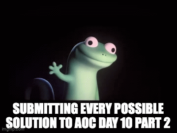

# Advent of Code 2025: (C)asually (c)omputing C-(C)ode (C4)
Fun with the advent of code 2025. This is me just experimenting around in C. Next year ~Rust~? I will try to use a exotic language every year. Thinking of either Matlab (what my studies try to force me into liking) or Bash Script (is that even realistic to finish in there?).
Binaries were compiled on M1 Max MacOS Tahoe 26.1.

## Repo Structure
This repo contains, as you can see, every day from Day 1 to Day 12 as a folder. In each folder is a `decoder.c` and a `decoder-{*specific-task*}.c`. The first part of the puzzle is always the `decoder.c`, the specified task is it's own program that can be run without any dependencies against `decoder.c`.

The solution always use system-level base dependencies.
They will not be the fastest nor the cleanest solution.

> [!TIP]
> Use your own `input.txt`-files to have correct solutions for your szenario.

## Solutions with my given input files

### [Day 1: Secret Entrance](day-1-secret-entrance)
1. password: 989
2. password pt. 2: 5941

### [Day 2: Gift Shop](day-2-gift-shop)
1. final sum: 38158151648
2. final sum pt. 2: 45283684555

### [Day 3: Lobby](day-3-lobby)
1. final sum: 17427
2. final sum pt. 2: 173161749617495

### [Day 4: Printing Department](day-4-printing-department)
1. final sum: 1553
2. final sum pt.2 : 8442

### [Day 5: Cafeteria](day-5-cafetaria)
1. final sum: 661
2. final sum pt.2: 359526404143208

### [Day 6: Trash Compactor](day-6-trash-compactor)
1. final sum: 5381996914800
2. final sum pt.2: 9627174150897

### [Day 7: Laboratories](day-7-laboratories)
1. final sum: 1602
2. final sum pt.2: 135656430050438

### [Day 8: Playground](day-8-playground)
1. final sum: 112230
2. final sum pt.2: 2573952864

### [Day 9: Movie Theater](day-9-movie-theater)
1. final sum: 4745816424
2. final sum pt.2: 1351617690

### [Day 10: Factory](day-10-factory)
1. final sum: 399
2. final sum pt.2: 15631

### [Day 11: Reactor](day-11-reactor)
1. final sum: 539
2. final sum pt.2: 413167078187872

### [Day 12: Christmas Tree Farm](day-12-christmas-tree-farm)
1. final sum: 521

## Highlights
Some of my AoC journey:
* Day 10 / Part 2 almost broke my spite, I was trying to brute-force the solution using a linear approximation. For some reason, the first 10 state machines were solving just fine, but the 11th machine was not bruteforceable or did not convolute in a static median. I let this bruteforcing algorithm run for three days (dec 23th-dec 25th) and could not find a solution for the 11th machine onewards. Then used a approch similar to what I would expect Z3 to do in this case and do a rational gaussian elimination approch.
* I would really like to write a small visulation of Day 7 (day-7-laboratories/decoder.c) to show a wavefront-like picture-by-picture solving. Maybe later :-)

## Learnings / bottom line of AoC '25
As this was my first AoC, I want to write down some learnings for the future.

* Benchmarking can be done for all solutions with `hyperfine ./{EXECUTABLE} -N --warmup 50 --min-runs 100`
* As C via the Arduino IDE was my first programming languge I really spend a lot of time with, programming in here was really nostalgic.
* I used in some puzzles external help (day 10 pt. 2 / day 11 pt. 2 / day 12), so this is **not** a repo that should count toward any highscores or official counting.
* [Great Resources for AoC's.](https://github.com/Bogdanp/awesome-advent-of-code)

